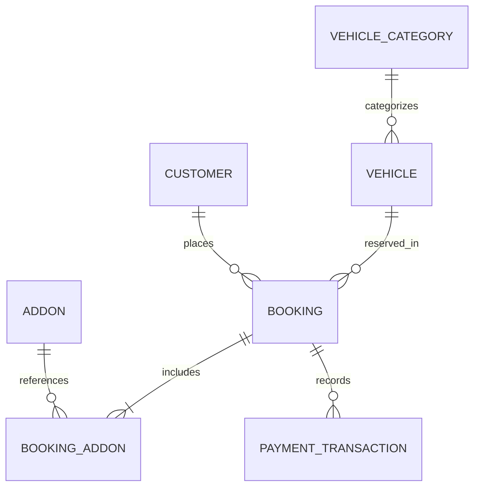

# Database Design & Data Modeling

## 1. Car Rental Core Entities & Relationships

### Entity Schemas:
1. **`Vehicle`**:
   - `id` (UUID / CUID)
   - `make`, `model`, `year`, `licensePlate`, `vin`
   - `categoryId` (FK -> VehicleCategory)
   - `status` (`AVAILABLE`, `RENTED`, `MAINTENANCE`, `RESERVED`)
   - `transmission` (`AUTOMATIC`, `MANUAL`)
   - `fuelType` (`PETROL`, `DIESEL`, `ELECTRIC`, `HYBRID`)
   - `seats`, `doors`, `luggageCapacity`
   - `mileage`, `locationId`
   - `dailyRate`, `hourlyRate`, `securityDeposit`
   - `images` (Array of URLs)

2. **`Booking`**:
   - `id`, `bookingReference` (e.g. `TNT-2026-8849`, unique indexed)
   - `customerId` (FK -> Customer)
   - `vehicleId` (FK -> Vehicle)
   - `pickupLocationId`, `returnLocationId`
   - `startDate` (TIMESTAMPTZ), `endDate` (TIMESTAMPTZ)
   - `status` (`PENDING`, `CONFIRMED`, `ACTIVE`, `COMPLETED`, `CANCELLED`, `REFUNDED`)
   - `basePrice`, `addonTotal`, `taxAmount`, `discountAmount`, `totalAmount`, `depositAmount`
   - `holdExpiresAt` (TIMESTAMPTZ, nullable for temporary holds)
   - `cancellationReason`, `createdAt`, `updatedAt`

3. **`BookingAddon`**:
   - `bookingId`, `addonId`, `quantity`, `unitPrice`, `totalPrice`

4. **`PaymentTransaction`**:
   - `id`, `bookingId`, `amount`, `currency`, `gateway` (`STRIPE`, `PAYPAL`), `gatewayRef`, `status` (`SUCCESS`, `FAILED`, `REFUNDED`), `createdAt`

## 2. Preventing Double Booking & Concurrency Control
- **Overlap Query Logic**: Two bookings for the same vehicle overlap if:
  `existing.startDate < newEndDate AND existing.endDate > newStartDate`
- **Database Indexing**:
  - Compound Index: `CREATE INDEX idx_booking_vehicle_dates ON bookings (vehicle_id, start_date, end_date) WHERE status IN ('CONFIRMED', 'ACTIVE', 'PENDING');`
- **Optimistic / Pessimistic Locking**: When locking a vehicle during checkout reservation, use a database transaction with `SELECT ... FOR UPDATE` or conditional update `WHERE status = 'AVAILABLE'` to guarantee atomic reservation without race conditions.

## 3. Idempotency & Audit Trails
- Support `idempotencyKey` on booking and payment creation to prevent duplicate charges on network retries.
- Maintain immutable timestamps (`createdAt`, `updatedAt`, `cancelledAt`).
